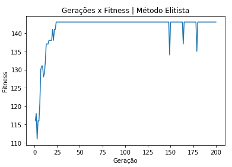
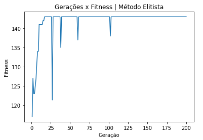
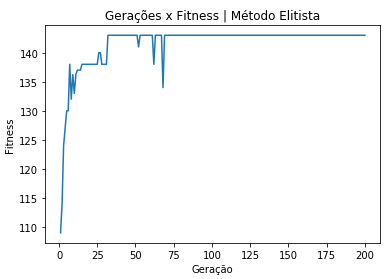
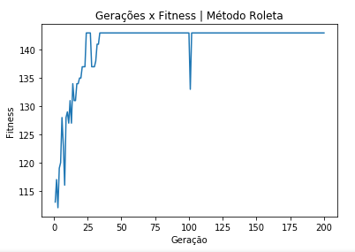
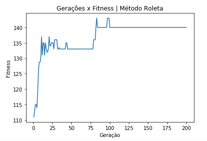
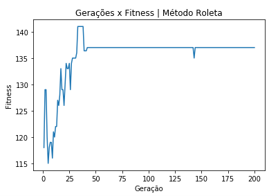
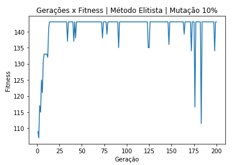
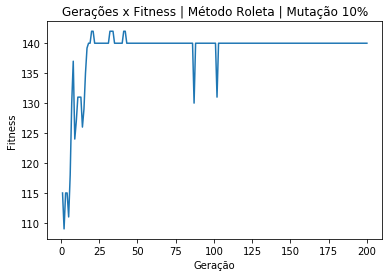

# problemaMochila
Resolução de problema da Mochila (knapsack problem) usando algoritmo genético, implementado em python.

O repositório possui um arquivo notebook do Jupyter para testes.

Resultados: 3 execuções, 100 População, 200 Gerações, Mutação: 3%.

Método Elitista

Método Roleta

Foi usada uma população de 100 indivíduos com 200 gerações. No processo de crossover foram usados dois pontos de corte variáveis.
Quando a capacidade da mochila estora, é aplicada uma penalização de 2% do valor total por ponto excedido. A mutação padrão escolhida foi de 3%.

Ao usar o método elitista de seleção de invidívuos para reprodução, eu acabei obtendo uma execução mais rápida, e ele alcançava o valor de 143 (melhor que consegui encontrar) algumas gerações mais cedo.
O método da roleta também acabou tendo mais ocasiões onde o melhor indivíduo da geração era pior do que a anterior, logo o fitness acabava diminuindo muito mais frequentemente do que o método elitista.

Ao usar uma porcentagem de mutação maior, de 10%, a quantidade de variações negativas aumenta.

O processo de mutação foi configurado de forma simples, onde ao encontrar um invidíduo para mutar, ele altera uma posição do array do gene desse indivíduo de 0 para 1, ou 1 para 0.
Ao aumentar a quantidade da população, a qualidade dos resultados melhora, mas o método da roleta perde muita performance comparado ao elitista, logo, se for utilizar uma população maior, é melhor ficar com o método elitista.
